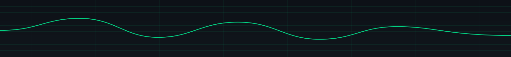
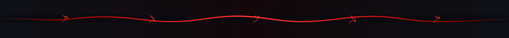

<div align="center">
  
  
  
  <br>
  
  
  
</div>

<div align="center">
  
</div>

<div align="center">
  
</div>

## OPERATOR PROFILE

```text
HANDLE:       AstroKreep
ROLE:         Developer • Creator • Systems Builder
LOCATION:     Undisclosed
FOCUS:        Games • AI • Rust Plugins • Automation • Developer Tools
ENVIRONMENT:  Unity • Blender • Rust & Schedule I Dedicated Servers • Windows
STATUS:       ONLINE — ALWAYS BUILDING
```

- 🧑‍💻 Developer: Big Cillin
- ✉️ Contact: Shiftmob@yahoo.com
- 🧠 Currently learning: Everything
- 👥 Open to collaborating on ambitious, strange, and genuinely interesting projects

<div align="center">
  
</div>

<p align="center">
  <a href="https://www.github.com/AstroKreep" target="_blank" rel="noreferrer">
    
  </a>
  <a href="https://www.twitch.tv/astro_kreep_" target="_blank" rel="noreferrer">
    
  </a>
  <a href="https://www.youtube.com/@shiftmob69?si=-o9L7moCBv1z2ifY" target="_blank" rel="noreferrer">
    
  </a>
  <a href="https://on.soundcloud.com/e8Gd398Q0SOydDZqrp" target="_blank" rel="noreferrer">
    
  </a>
</p>

<p align="center">
  <a href="https://www.github.com/AstroKreep" target="_blank" rel="noreferrer">
    
  </a>
  <a href="https://www.twitch.tv/astro_kreep_" target="_blank" rel="noreferrer">
    
  </a>
  <a href="https://on.soundcloud.com/e8Gd398Q0SOydDZqrp" target="_blank" rel="noreferrer">
    
  </a>
</p>

<div align="center">
  
</div>

<div align="center">
  
</div>

I build systems that feel alive.

My work spans **Unity game development**, **Rust server plugins**, **AI-driven behavior systems**, **autonomous tooling**, **local dashboards**, and **developer workflows**. I like taking ideas from rough concepts to usable systems that feel intentional, modular, and weird in the best possible way.

The goal is not just to write code.  
The goal is to build things that are **useful, expandable, intentional, and fun to create**.

<div align="center">
  
</div>

<div align="center">
  
</div>

<table>
<tr>
<td width="50%" valign="top">

### 🎮 Game Development
- Experimental gameplay mechanics
- Modular character systems
- Dynamic NPC behavior
- Replayable systems
- PS1 / PS2-inspired visuals
- Unusual world mechanics

</td>
<td width="50%" valign="top">

### 🦀 Rust Development
- Oxide and uMod plugins
- Native-feeling gameplay systems
- Premium admin tooling
- Configurable server events
- Performance-focused architecture
- Immersive server mechanics

</td>
</tr>
<tr>
<td width="50%" valign="top">

### 🧠 AI and Autonomous Systems
- Biologically-inspired NPC intelligence
- Perception and decision loops
- Persistent memory concepts
- Adaptive behavior systems
- Strategic automation
- Emergent behavior exploration

</td>
<td width="50%" valign="top">

### 🔧 Developer Tooling
- Server monitoring
- RCON control
- Automated workflows
- Release preparation
- Local dashboards
- AI-assisted development pipelines

</td>
</tr>
</table>

<div align="center">
  
</div>

<div align="center">
  
</div>

<table>
<tr>
<td width="50%" valign="top">

### 🧬 Flagellum AI
**STATUS:** ACTIVE  
Biologically-inspired NPC architecture modeled after bacterial flagellum behavior.

- Modular perception
- Environmental sensing
- Decision-making
- Directional control
- Emergent NPC behavior

</td>
<td width="50%" valign="top">

### 🛡️ Rust Plugin Ecosystem
**STATUS:** EXPANDING  
A growing collection of custom Rust systems built for immersion and control.

- Dynamic server events
- NPC behavior tools
- Player interaction systems
- Security and moderation tools
- Server diagnostics

</td>
</tr>
<tr>
<td width="50%" valign="top">

### 🗺️ Interactive 3D Rust Map
**STATUS:** IN DEVELOPMENT  
A private browser-based platform for exploring and visualizing Rust servers.

- First-person exploration
- Free-flight navigation
- Monument visualization
- Live server information
- Interactive overlays

</td>
<td width="50%" valign="top">

### 🧠 ShiftMob Nexus
**STATUS:** OPERATIONAL  
A modular autonomous-agent and development platform.

- Project intelligence
- Knowledge storage
- Release management
- Approval workflows
- Persistent system memory

</td>
</tr>
<tr>
<td width="50%" valign="top">

### 📡 RaidOps
**STATUS:** ACTIVE DEVELOPMENT  
A Rust-focused mobile platform for players, communities, and server owners.

- Server discovery
- Group formation
- Community tools
- Mobile server management
- Team coordination

</td>
<td width="50%" valign="top">

### ⚙️ Local Server Systems
**STATUS:** ONLINE  
Private tooling for local Rust server management and operations.

- Local dashboards
- Server metrics
- RCON control
- Automated startup
- Performance monitoring

</td>
</tr>
<tr>
<td width="100%" colspan="2" valign="top">

### 🎮 [Schedule I Dedicated Server](https://github.com/AstroKreep/Schedule-I)
**STATUS:** ONLINE  
A self-hosted operations layer for *Schedule I* dedicated servers — built on MelonLoader + S1DedicatedServers, not a fork of either.

- Auto-restart watchdog with crash-loop protection
- Verified, hashed backups with automatic retention
- Schedule I Doctor health diagnostics
- MCP server giving Claude Code direct, tool-based server control
- Custom mods fixing real dialogue-sync and gameplay bugs

</td>
</tr>
</table>

<div align="center">
  
</div>

<div align="center">
  
</div>

### Languages
<p>
  
  
  
  
  
  
  
  
</p>

### Engines and Creative Tools
<p>
  
  
  
  
  
</p>

### Development and Infrastructure
<p>
  
  
  
  
  
  
  
  
</p>

### AI-Assisted Development
<p>
  
  
  
  
  
  
</p>

<div align="center">
  
</div>

<div align="center">
  
</div>

- Build systems that solve real problems
- Keep architecture modular
- Make configuration understandable
- Protect user privacy
- Avoid unnecessary dependencies
- Design interfaces that feel intentional
- Test before calling something finished
- Build for expansion without overengineering
- Keep the user experience clean
- Leave every project better than it started

<div align="center">
  
</div>

<div align="center">
  
</div>

My projects often combine:

- Dark industrial interfaces
- Security-console visual design
- Deep red and charcoal palettes
- Low-poly and retro-inspired art
- Immersive worldbuilding
- Experimental artificial intelligence
- Player freedom
- Modular systems that grow over time
- Native-feeling gameplay
- Strange ideas with practical execution

<div align="center">
  
</div>

<div align="center">
  
  <br>
  
  <br>
  
</div>

<div align="center">
  
</div>

<div align="center">
  
  
</div>

<div align="center">
  
</div>

<div align="center">
  
</div>

If one of my projects helps you, inspires you, or gives you an idea:

**Leave a ⭐ on the repository.**

Stars help other developers discover the work and show me which systems are worth expanding.

<div align="center">
  <a href="https://github.com/AstroKreep?tab=repositories">
    
  </a>
</div>

<div align="center">
  
</div>

<div align="center">
  
  
  
</div>

<!--
╔══════════════════════════════════════╗
║         HIDDEN TERMINAL FOUND        ║
╠══════════════════════════════════════╣
║ ACCESS LEVEL: OPERATOR               ║
║ HANDLE: ASTROKREEP                   ║
║ STATUS: CLEARANCE GRANTED            ║
║ MESSAGE: KEEP BUILDING STRANGE SHIT  ║
╚══════════════════════════════════════╝
-->
